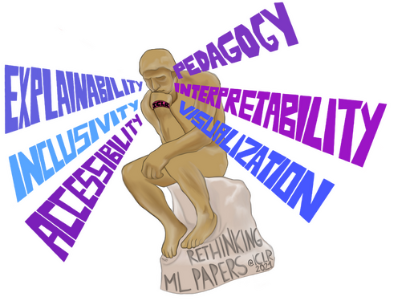

---
# Feel free to add content and custom Front Matter to this file.
# To modify the layout, see https://jekyllrb.com/docs/themes/#overriding-theme-defaults

permalink: /
title: Home
layout: home
---

> "All communication must lead to change." -- Aristotle

<figure>
	

		
		<figcaption>Image Credits: <a href="https://falaaharifkhan.github.io/research/">Falaah Arif Khan</a></figcaption>
	

</figure>
<!--  -->

Over the last decade, the volume of conference submissions in machine learning has broken records across the sciences. According to some estimates, submissions at machine learning conferences account for over 0.5% of all scientific papers published today. While submissions are at an all-time high, there is growing concern in the ML community about where the field is headed. The current pandemic gives researchers a long-awaited opportunity to pause and reflect: what kind of legacy do we want to leave behind? Is it in the number of papers we publish, or the number of citations we accumulate? Or, is it in the clarity and transparency of scientific communication? We believe the answers to these questions will shape the next few years of ML research.

How might we improve the scientific paper to create a more sustainable platform for future contributors? Many proposals have emerged, from novelty and rigor ([Sculley et al., 2018](https://openreview.net/pdf?id=rJWF0Fywf)), to reproducibility ([Pineau et al., 2020](https://arxiv.org/abs/2003.12206)), explainability ([Olah and Carter, 2017](https://distill.pub/2017/research-debt/)) and accessibility ([Morris, 2019](https://arxiv.org/abs/1908.08939)). In an era of social isolation and remote work, the importance of clear communication is crucial, both for demonstrating scientific progress and building human intuition and understanding. We propose taking a more holistic view of the conference paper, not just as a medium for communicating with a highly sophisticated audience, but as a tool for disseminating knowledge to the next generation of scientific researchers. In this workshop, to be organized at [ICLR 2021](https://iclr.cc/) we propose to discuss three high-level themes:

* Accessibility and inclusivity - How do we design an inclusive publication format for ML research?
* Explainability and pedagogy - How do we communicate ML research and theory more effectively?
* Interpretability and visualization - How do we interpret complex information in a visual setting?

The research paper was originally a document printed and bound in journals: over time, these documents were published online and underwent minor cosmetic changes, yet many assumptions of the original format survive, namely, that research must take the form of a paper artifact. Yet modern ML research often contains multimedia and rich interactive applications, often hosted externally and can be displaced or go missing. To accommodate the diversity of new content, authors and publishers must adopt a more inclusive format for sharing scientific research and redesign conference publications to meet the evolving information needs of both authors and readers alike.

Among the ML research community, there is a variety of innovative content that does not reach traditional machine learning conferences. By showcasing work from ML researchers on the frontiers of digital publication, we hope to raise awareness for alternative writing styles and templates for publication. How can we improve understanding through scientific communication? How can we make the medium more inclusive and accessible for current and future contributors? These are some of the themes we hope to explore in our workshop. Please join us for an exciting discussion on redesigning the scientific paper for machine learning research!

### Related past workshops

1. [Visualization for AI Explainability (VISxAI)](https://visxai.io/) - 2020
2. [Beyond the PDF](https://sites.google.com/site/beyondthepdf/home) - 2011
3. [How to write a good review?](https://sites.google.com/view/making-reviews-great-again/) - CVPR 2020
4. [Reproducibility in ML](https://sites.google.com/view/icml-reproducibility-workshop/home)
5. [ML Retrospectives](https://ml-retrospectives.github.io/) - 2020
